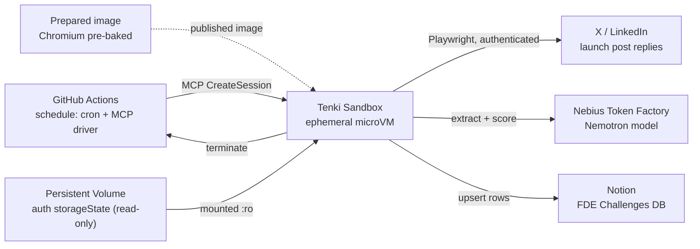

# Video Tutorial Script: Week 1 - FDE Challenges Social Intake (Tenki Sandbox + Nebius Token Factory)

## Recording Target

Target edited runtime: 20-25 minutes. This has more moving parts than the
Nebius Webinar 1 script (Tenki + Nebius Token Factory + Notion + GitHub
Actions vs. a single cloud VM), so expect more to cut in editing, not less.

This should feel like a guided build, not a command-reading session. The
companion docs for exact copy-paste blocks are
[`README.md`](README.md), [`template/README.md`](template/README.md), and
[`../../workstreams/fde-challenges-social-intake/docs/week-1-implementation-plan.md`](../../workstreams/fde-challenges-social-intake/docs/week-1-implementation-plan.md).

## Important: this has not been dry-run tested yet

Unlike the Nebius Webinar 1 script (written after a validated dry run), **this
recording is the first real end-to-end test of this pipeline.** Two segments
are flagged below as likely to need live debugging:

- **LinkedIn's comment selectors** (Segment 8) — best-effort CSS selectors
  that were never checked against a live post.
- **The MCP worker run** (Segment 11) — unverified against this account; it
  clones the worker source inside the sandbox instead of using the CLI bundle.

That's fine content, not a failure to hide. "Here's what broke and how I
figured it out" is exactly the FDE-relevant material this series is for. Don't
pre-script a fake success for these two — narrate the actual debugging live.

## Participant Outcome

By the end of the video, the viewer has seen:

- A first Tenki sandbox created and torn down through the temporary MCP
  fallback, after showing the CLI API-key scope bug it works around.
- A published Tenki Sandbox image with Chromium pre-baked.
- A persistent volume holding an authenticated test-account session, reused
  across ephemeral worker runs.
- Why the collection account is a dedicated test/burner account, not
  Frutero's or Dabl's real accounts.
- A Notion `FDE Challenges` database receiving real, structured rows scored
  by Nebius Token Factory.
- The worker running once locally, then once via a GitHub Actions
  cron-triggered sandbox — the actual "launch sandboxes as workers" pattern
  this series exists to teach.
- A clear "as an FDE would use it" framing: disposable, cost-efficient,
  scoped to one real workflow — not a throwaway dev box.

## Recording Rule

- Never show the Tenki API key, Nebius API key, Notion API key, or the test
  account's real login on screen.
- Say out loud, on camera, that this uses a dedicated test/burner account and
  why (isolates ToS/account-suspension risk from the brand accounts) — this is
  a real decision worth explaining, not just a disclaimer.
- Terminate every Tenki sandbox session shown before ending the recording —
  billing is per-second, but a forgotten `--sticky` session is still a real
  cost.
- When a command takes longer than 20-30 seconds (image provisioning, Playwright
  system-dep install), pause recording or speed-ramp in editing.

## Timeline

| Time | Segment | Main Screen | Teaching Goal |
| --- | --- | --- | --- |
| 0:00-1:00 | Open | Camera / README | What Week 1 is and where it stops |
| 1:00-3:00 | Architecture | Diagram | Tenki Sandbox vs. Nebius Token Factory vs. Notion, and why a recurring worker |
| 3:00-6:00 | Explore Tenki + API key + MCP fallback | Browser + terminal | Show the CLI bug and the scoped API workaround |
| 6:00-8:00 | Sandbox quickstart | Terminal | Ground the primitive: create, exec, terminate |
| 8:00-11:00 | Build the prepared image | Terminal + template/README.md | Bake Chromium once so workers skip cold install |
| 11:00-13:00 | Persistent Volume | Terminal | Durable auth state across disposable workers |
| 13:00-15:30 | Capture test-account session | Browser + terminal | Human logs in by hand; script only saves the session |
| 15:30-16:30 | Seed the volume | Terminal | Get the storageState files into Tenki |
| 16:30-18:00 | Notion + Nebius setup | Browser + terminal | Database schema, integration, API key |
| 18:00-20:30 | Run the worker locally | Terminal | Collection -> extraction -> Notion, live, whatever happens |
| 20:30-22:30 | Wire GitHub Actions + trigger | Browser + terminal | The actual scheduled-worker pattern |
| 22:30-23:30 | Show Notion results | Browser | The payoff: real scored challenge candidates |
| 23:30-24:30 | Wrap + recap + CTA | Camera | Cost recap, what's next, reply to the launch post |

All times past Segment 3 shifted +2 minutes to absorb the dashboard/API-key
walkthrough and MCP fallback setup — approximate either way pre-dry-run, not
worth precision here.

If running long, cut Segment 4 (quickstart) to a voiceover-only recap and skip
straight to the prepared-image build — the quickstart is nice-to-have grounding,
not essential once the architecture segment has explained it.

## Architecture Diagram

Show this early, then return to it before the wrap.



Narration:

"Four things stay separate. GitHub Actions is just the clock — it fires on a
schedule and does nothing else. Tenki Sandbox is the disposable compute — it
boots from an image that already has Chromium installed, does the work, and
disappears. Nebius Token Factory is where the actual language model call
happens. Notion is where the results land for a human to review. None of these run
all the time. That's the whole point."

## Pre-Recording Checklist

Open these tabs before recording:

- This repo's [`README.md`](README.md) and [`template/README.md`](template/README.md)
- Tenki Sandbox quickstart: https://tenki.cloud/docs/sandbox/quick-start-sandbox
- Tenki Templates docs: https://tenki.cloud/docs/sandbox/templates
- Tenki Persistent Volumes docs: https://tenki.cloud/docs/sandbox/volumes
- Nebius Token Factory console: https://tokenfactory.nebius.com
- Notion (a workspace you can create a test database in)
- The actual Dabl/Frutero launch post URL(s) — if the launch hasn't happened
  yet, use any real public post you're comfortable showing, and say so on
  camera ("we don't have a live launch post yet, so I'm testing against
  this one instead")

Terminal prep:

- One local terminal for the MCP fallback and `npm` commands.
- A browser window for the test/burner account login (Segment 7) — keep this
  window framed so the login form doesn't show the actual password being typed.

## Segment 1: Open

Target time: 0:00-1:00

Narration:

"This is Week 1 of the Dabl Club and Frutero forward-deployed-series. The
challenge: Dabl and Frutero post publicly on X and LinkedIn asking builders for
real business problems that need an AI or tech solution. We need a way to
collect those replies, filter out the noise, and turn the real ones into a
scored, shortlist-ready backlog — without running a server 24/7 for what's
really an occasional job."

"Today we build that as a worker that spins up a disposable Tenki Sandbox on a
schedule, reads the replies, calls a model through Nebius Token Factory to
extract the structured fields, and writes the results into Notion. Then it
shuts itself down."

Learning beat:

- This is a public prototype, not production social listening — scoped to
  replies on one specific post.
- The point isn't just "scrape social media" — it's "run a specific,
  cost-efficient workflow the way an FDE actually would."

## Segment 2: Architecture

Target time: 1:00-3:00

Screen: the architecture diagram above.

Narration:

"GitHub Actions is only a clock. Tenki Sandbox is where the work actually
happens, in a microVM that gets destroyed right after. Nebius Token Factory is
an OpenAI-compatible inference endpoint — we're reusing the exact same
Nemotron model setup from the Nebius webinar series, so if you've seen that,
this will look familiar."

"Notion is the database a human reviews. And there's one more piece not in
this diagram yet: a Persistent Volume holding an authenticated browser
session, because — and this is worth explaining — X and LinkedIn don't show
you replies to a post unless you're logged in. We tested that before this
recording."

Learning beat:

- Confirmed live (2026-07-22): a specific X post's reply thread shows only a
  `Read N reply` teaser logged out; LinkedIn redirects straight to an
  authwall. Say this on camera with the actual URLs tested, it's a good,
  concrete "here's what we found out" beat.

## Segment 3: Explore Tenki, Show the CLI Bug, and Use the MCP Fallback

Target time: 3:00-6:00

Screen: tenki.cloud homepage, then the docs, then app.tenki.cloud, then terminal.

Narration:

"Quick tour before we touch the terminal. This is Tenki Cloud — disposable
Linux microVMs, billed per second. Their docs are what we've been building
this whole pipeline from, so it's worth knowing they're here: sandbox
quickstart, templates, persistent volumes, all of it."

Screen action: briefly show tenki.cloud, then the docs sidebar (Sandbox
section) — a few seconds each, this is orientation, not a reading session.

Run locally:

```bash
curl -fsSL https://tenki.cloud/install.sh | bash
```

Narration:

"Now, authentication — and here's a real thing that happened while building
this. The default `tenki login` browser callback failed locally, so we used an
API key. Then the CLI accepted that key but refused to create a sandbox because
it had not retained a project ID. We reported that to Tenki. Their DevRel team
shared an MCP implementation that calls `WhoAmI`, resolves the project, and
sends it explicitly. That lets us keep building while the CLI issue is fixed."

Screen action: sign in at [app.tenki.cloud](https://app.tenki.cloud), select
Tenki Sandbox.

Narration:

"First time through, this completes Sandbox onboarding, and Tenki generates
an initial API key automatically — I'm copying it now. If you need another
one later, say a separate key for CI, that's under API Keys -> Create API
Key."

**Do not show the actual key value on screen** — cut away or blur before it's
visible, then continue with it already exported.

```bash
git clone https://github.com/opencolin/tenki-mcp.git /tmp/tenki-mcp
git -C /tmp/tenki-mcp checkout 8278e81
npm --prefix /tmp/tenki-mcp ci && npm --prefix /tmp/tenki-mcp run build

cd mcp-workaround
npm ci
export TENKI_API_KEY=tk_your_api_key
export TENKI_MCP_SERVER=/tmp/tenki-mcp/dist/index.js
npm run proof
```

Narration:

"The proof first calls `WhoAmI`, then creates a tiny disposable sandbox with
that workspace and project, runs `uname` and `whoami`, and terminates it in a
`finally` block. That is a good workaround because it is explicit about the
scope the CLI dropped, rather than guessing or storing an ID in source code."

Learning beat:

- Note the workspace/project ID on screen (not sensitive, fine to show), but
  never show the API key.
- Name the two MCP gaps we found: this version publishes an image from a
  prepared sandbox rather than directly from a Template, and it writes text
  files rather than the original binary bundle. Those are concrete product
  feedback, not hidden caveats.

## Segment 4: Sandbox Quickstart

Target time: 6:00-8:00

Run locally:

```bash
npm run proof
```

Narration:

"Before building the real thing, here's the primitive in its simplest form.
This is a disposable Linux microVM — sub-2-second boot, billed per second.
The MCP proof calls `create`, `exec`, and `terminate` through Tenki's API.
Everything after this is the same lifecycle, just wired to our actual workflow
instead of `uname -a`."

Learning beat:

- This is Tenki's quickstart lifecycle with the missing API-key project scope
  supplied explicitly, so the workaround is easy to compare with the CLI docs.

## Segment 5: Build the Prepared Image

Target time: 8:00-11:00

Screen: `template/README.md` and `template/setup-script.sh`.

Run locally:

```bash
cat template/setup-script.sh
```

Narration:

"This setup script installs Playwright and its Chromium browser once, at
build time, not on every worker run. Without this, every sandbox session would
spend a minute or two downloading and installing the browser before doing any
real work — for a job that itself only takes a few seconds. The prepared image
is where that cost gets paid exactly once. The main guide uses Tenki Templates;
this MCP fallback instead prepares a temporary builder sandbox, publishes its
disk as a private image, and destroys the builder. Same runtime result, plus
useful product feedback about the missing Template-to-registry bridge."

Run locally:

```bash
npm run provision-image -- --image <your-workspace>/fde-intake-worker:latest
```

Cut note: provisioning takes a few minutes (apt installs + browser download)
— speed-ramp this in editing.

Narration:

"Publishing gives it a reference — `<workspace>/fde-intake-worker:latest` —
that any session can boot from afterward with zero install step."

Learning beat:

- Note the Playwright version pin in `setup-script.sh` and `package.json`
  match (`1.61.1`) — call out why: the cached browser revision has to match
  what the bundled `node_modules/playwright` expects at run time.
- If you change this script later, repeat `provision-image`; the published
  image is versioned, not silently mutated.

## Segment 6: Persistent Volume

Target time: 11:00-13:00

Run locally:

```bash
npm run create-volume
```

Narration:

"Sandboxes are disposable — nothing on their filesystem survives termination.
But we don't want to log in every single run. A Persistent Volume is
workspace-scoped storage that outlives any one session, so we log in once,
save that to the volume, and every worker run afterward mounts it read-only."

Learning beat:

- This is the same primitive Tenki recommends for package caches / build
  caches — we're using it for durable auth state instead, which is a slightly
  unusual but legitimate use of the same tool.

## Segment 7: Capture the Test-Account Session

Target time: 13:00-15:30

Run locally:

```bash
npm install
npm run capture-auth -- x ./secrets/x.storageState.json
```

Narration, before running:

"This next part matters: I'm using a dedicated test account here, not
Frutero's or Dabl's real X account. Both platforms' terms generally restrict
automated access outside their official APIs, and a recurring automated
worker carries more risk than a one-off check. Using a burner account keeps
that risk away from the accounts that actually matter for the launch."

"This script opens a real, visible browser window. I log in by hand, like a
person — the script doesn't touch the login form at all. It only saves the
resulting session afterward, so everything automated from here on reuses a
session a human actually created."

Screen action: frame the browser window so the login form's password field
isn't legible on camera. Log in. Return to the terminal, press Enter.

Repeat for LinkedIn:

```bash
npm run capture-auth -- linkedin ./secrets/linkedin.storageState.json
```

Learning beat:

- This distinction — a human logs in, automation only reuses the session — is
  worth stating explicitly. It's the difference between "automating a login"
  (higher risk, more clearly against most platforms' terms) and "reusing a
  session a human created" (lower risk, still not risk-free).

## Segment 8: Seed the Volume

Target time: 15:30-16:30

Run locally:

```bash
npm run seed-auth-volume -- \
  --volume <volume-id> \
  --x-state ../secrets/x.storageState.json \
  --linkedin-state ../secrets/linkedin.storageState.json
```

Narration:

"One throwaway session, mounted read-write just this once, to get the two
session files onto the volume. Every worker session after this mounts the same
volume read-only."

**Flag for live debugging:** the LinkedIn comment selectors in `src/collect.ts`
were written from general knowledge of LinkedIn's DOM, not verified against a
live post. If this segment or the next one shows zero LinkedIn replies where
you expect some, that's the selectors needing a real fix, not the architecture
being wrong — a good, honest moment to show devtools and find the real
selector live.

## Segment 9: Notion and Nebius Setup

Target time: 16:30-18:00

Screen: Notion, then Nebius Token Factory console.

Narration:

"The `FDE Challenges` database schema is in the Week 1 service spec — I'm
creating it directly in Notion now, plus one extra `id` field the code uses
internally to avoid duplicate rows on re-runs."

Create the Notion database and integration, share it with the integration,
copy the API key and database ID.

```bash
# Nebius Token Factory key — same setup as the nebius webinar series
export NEBIUS_API_KEY=...   # from https://tokenfactory.nebius.com
```

Learning beat:

- Point out this is the exact same Token Factory pattern from the Nebius
  webinar series — same endpoint, same model choice — reused rather than
  re-derived. Worth a quick "if you've seen that series, this is familiar"
  callout.

## Segment 10: Run the Worker Locally

Target time: 18:00-20:30

Run locally:

```bash
cp .env.example .env
# fill in NEBIUS_API_KEY, NOTION_API_KEY, NOTION_DATABASE_ID,
# X_POST_URL and/or LINKEDIN_POST_URL,
# X_STORAGE_STATE_PATH / LINKEDIN_STORAGE_STATE_PATH -> ./secrets/*.json

npm run dev
```

Narration:

"This is the real test. Whatever happens here — replies collected, extracted,
scored, and landing in Notion, or an error we have to chase down — that's the
actual content. Don't cut around a failure here; show the fix."

Learning beat:

- This is the first true end-to-end run of this pipeline. Treat whatever
  happens as the payoff moment of the video, not a scripted beat.

## Segment 11: Wire GitHub Actions and Trigger

Target time: 20:30-22:30

Screen: https://github.com/fruteroclub/fde-challenges-social-intake settings
(secrets/variables), then the Actions tab.

Set:

- Secrets: `TENKI_API_KEY`, `TENKI_AUTH_VOLUME_ID`, `NEBIUS_API_KEY`,
  `NOTION_API_KEY`, `NOTION_DATABASE_ID`
- Variables: `TENKI_IMAGE` (e.g. `<your-workspace>/fde-intake-worker:latest`),
  `X_POST_URL`, `LINKEDIN_POST_URL`

Trigger manually instead of waiting for the cron:

```bash
gh workflow run refresh-mcp.yml
gh run watch
```

**Flag for live debugging:** `.github/workflows/refresh-mcp.yml` builds the
pinned MCP server, launches the worker image with explicit scope, mounts the
auth volume, and clones the worker repository in the sandbox. It has not run
against this account yet. If it fails, show the returned MCP error and compare
it with the CLI failure rather than treating the workaround as magic.

Narration:

"This is the actual lesson of Week 1: a scheduled trigger that costs nothing
between runs, spinning up a sandbox that costs fractions of a cent per run,
doing one real job, and disappearing."

## Segment 12: Show the Results

Target time: 22:30-23:30

Screen: the Notion database, populated.

Narration:

"Here's what landed: each row is one reply, scored for feasibility and public
build value, with a filter status. Anything needing clarification stays out
of the shortlist for Week 1 — we're not building a back-and-forth
clarification loop yet, just filtering it out cleanly."

## Segment 13: Wrap, Recap, CTA

Target time: 23:30-24:30

Narration:

"Recap: a prepared Tenki image with Chromium baked in, a persistent volume holding
an authenticated session, a scheduled GitHub Actions trigger spinning up
disposable workers, Nebius Token Factory doing the extraction, and Notion as
the human review surface. Total compute cost for a run: fractions of a cent —
Tenki's small instance is $0.17 an hour, and each run lasts a couple of
minutes at most."

"If you've got a real business or client workflow that needs an AI or tech
solution, reply to the launch post on X or LinkedIn — that's genuinely how
this pipeline finds its next challenge."

## Editing Notes

- Keep the edited video under 25 minutes; cut waiting time from image
  provisioning, `npx playwright install --with-deps`, and package installs.
- If Segments 8 or 11 turn into extended live-debugging, that's fine to keep
  in — it's the most honest FDE content in the video — but trim to the
  actual fix, not every dead end.
- Mask all API keys, the test account's password field, and any real personal
  info from the actual launch post repliers (anonymize per the spec's public
  safety scoring before showing real submitter text on screen, if the launch
  has already happened by recording time).
- Keep the architecture diagram visible early and briefly return to it in the
  wrap.

## Readiness Verdict

This script is ready to record from, but unlike the Nebius Webinar 1 script,
it has **not** been validated by a prior dry run. Segments 8 and 11 are named
explicitly as likely debugging moments. Budget real time for them rather than
assuming the raw recording matches the timeline above — a first live run of a
new pipeline typically runs long, and that's fine to cut down in editing.
